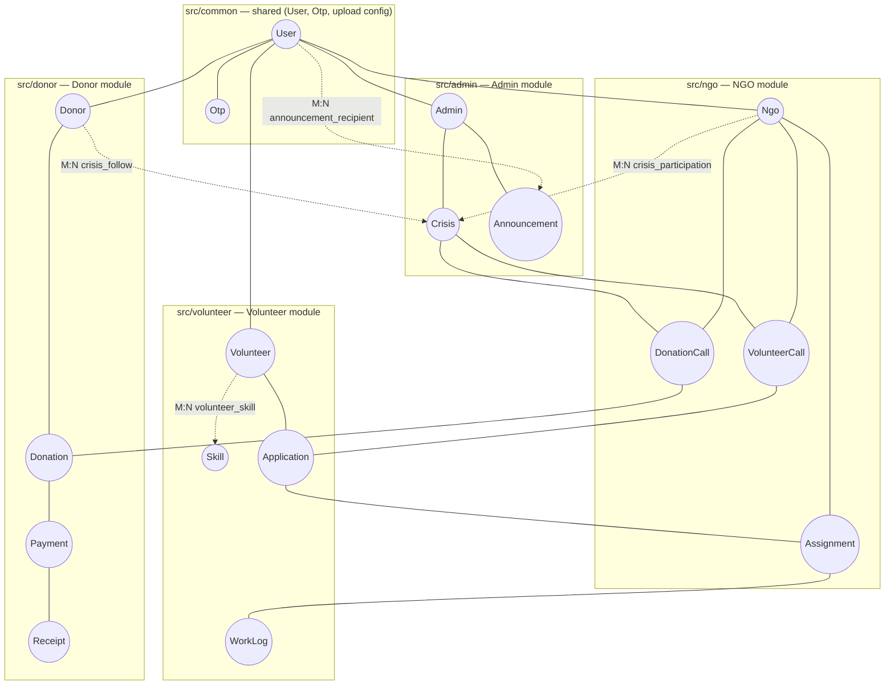
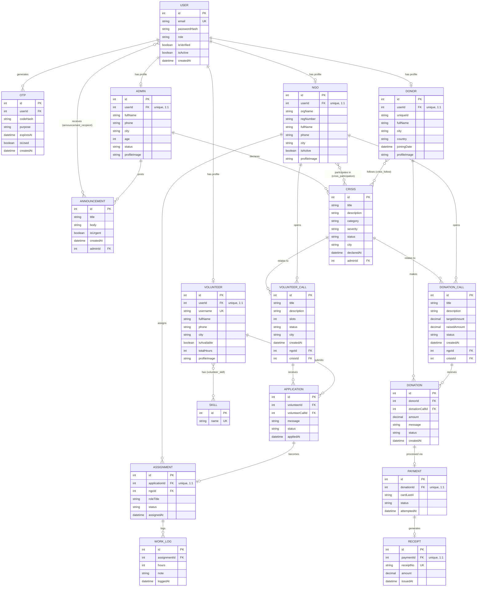

# CrisisConnect — Backend

> A crisis-relief coordination platform connecting **Admins**, **NGOs**,
> **Volunteers**, and **Donors** on one platform — built as a midterm project
> for *Advanced Programming in Web Technology*.

<!-- Fill in for submission -->
| | |
| --- | --- |
| **Course** | Advanced Programming in Web Technology |
| **Semester** | Summer 2025–2026 |
| **Institution** | American International University-Bangladesh (AIUB) |
| **Submission** | Midterm Project |

## Team

| Role / Module | GitHub | Branch | Owns |
| --- | --- | --- | --- |
| Admin | [@steve-A7](https://github.com/steve-A7) | `admin` | `src/admin/` |
| NGO | [@Rezwoan](https://github.com/Rezwoan) | `ngo` | `src/ngo/` |
| Volunteer | [@nirzordas](https://github.com/nirzordas) | `volunteer` | `src/volunteer/` |
| Donor | [@nazmussakib0203](https://github.com/nazmussakib0203) | `donor` | `src/donor/` |

Each member owns one role end-to-end: its database entities, its business
logic, and its API routes. Ownership is enforced by
[`.github/CODEOWNERS`](./.github/CODEOWNERS) — see
[CONTRIBUTING.md](./CONTRIBUTING.md) for the full workflow.

## 1. Project overview

CrisisConnect is a REST API that lets an **Admin** declare a crisis and
broadcast announcements; an **NGO** respond to a crisis by opening volunteer
and donation calls; a **Volunteer** apply to those calls and get assigned
work; and a **Donor** follow a crisis and fund it, with a payment and receipt
trail. The four roles are independent NestJS modules that share one
PostgreSQL database and a common `User`/`Otp` authentication layer.

### Objectives

- Model a realistic, multi-actor relief-coordination domain with a
  normalized relational schema (17 entities, 4 join tables).
- Practice a real team Git workflow: per-person branches, `CODEOWNERS`-enforced
  review boundaries, and PRs into a shared `dev` branch.
- Implement authentication, role-specific CRUD, and file uploads on top of
  NestJS + TypeORM.

## 2. Tech stack

| Layer | Choice |
| --- | --- |
| Runtime / framework | [NestJS](https://nestjs.com/) 11 (Express platform) |
| Database / ORM | PostgreSQL + [TypeORM](https://typeorm.io/) (`synchronize: true` for dev) |
| Validation | [class-validator](https://github.com/typestack/class-validator) / class-transformer |
| Config | [@nestjs/config](https://docs.nestjs.com/techniques/configuration) |
| File uploads | Multer (`@nestjs/platform-express`) + `@nestjs/serve-static` |
| Language | TypeScript |

## 3. Architecture

Each role is a self-contained NestJS module (`controller` → `service` →
`entities`/`dto`), all registered in one `AppModule` and sharing one
Postgres database via `src/common/`:



Solid lines are direct foreign-key relationships; dashed lines are the four
many-to-many join tables. A module only ever *reads/writes through its own
repository* — cross-module data access is done by importing the other
role's entity class and registering it in your **own** module's
`TypeOrmModule.forFeature([...])`, never by editing another role's files
(see [CONTRIBUTING.md](./CONTRIBUTING.md)).

## 4. Database design — Entity-Relationship Diagram

Full schema: 17 entities (`user`, `otp`, plus 3–4 per role) and 4 join
tables (`crisis_participation`, `announcement_recipient`, `volunteer_skill`,
`crisis_follow`), derived from `CrisisConnect_Midterm_PRD.md` (Part 3).



> Both diagrams render automatically on GitHub (Mermaid). If viewing this
> file elsewhere, open it on GitHub or in an editor with Mermaid preview
> (e.g. VS Code + "Markdown Preview Mermaid Support").

## 5. Project structure

```
src/
  common/      Shared, repo-owner-only — User & Otp entities, common.enums.ts,
               config/multer.config.ts (shared upload config)
  admin/       Admin module      — users, crises, announcements
  ngo/         NGO module        — crisis participation, volunteer/donation calls, assignments
  volunteer/   Volunteer module  — registration, skills, applications, work log
  donor/       Donor module      — crisis following, donations, payments, receipts
  app.module.ts, main.ts         — app bootstrap, DB connection, static file serving
```

Each role folder owns its own `*.controller.ts`, `*.service.ts`, `dto/`,
`entities/`, `*.enums.ts`, and `*.module.ts`. See each folder's own
`*_TASKS.md` (build guide) and `*_API_TESTING.md` (Postman reference) for
that role's details.

## 6. Feature status

| Role | Status |
| --- | --- |
| Admin | Schema complete · base route live · CRUD/auth in progress |
| NGO | Schema complete · base route + `POST /ngo/profile/image` live (reference implementation) · remaining routes in progress |
| Volunteer | Schema complete · base route live · CRUD/auth in progress |
| Donor | Schema complete · base route live · CRUD/auth in progress |

Every role has a `profileImage` column and a `POST /<role>/profile/image`
upload endpoint (multipart, field name `image`, jpeg/png/webp only, 2 MB
max), saved to its own `uploads/<role>/` folder and served back at
`/uploads/<role>/<filename>`. NGO's route is the working reference
implementation the other three roles build theirs from.

## 7. Setup

### 7.1 Install dependencies

```bash
npm install
```

### 7.2 Configure your local database

This project does **not** hardcode database credentials — each person runs
their own local PostgreSQL instance. Copy the example env file and fill in
your own values:

```bash
cp .env.example .env
```

```
PORT=3000

DB_HOST=localhost
DB_PORT=5432
DB_USERNAME=postgres
DB_PASSWORD=<your local postgres password>
DB_NAME=users
```

`.env` is gitignored — it will never show up in `git status` or a PR diff,
so everyone can use different local credentials without merge conflicts.

Make sure PostgreSQL is running locally and the database named in
`DB_NAME` exists:

```sql
CREATE DATABASE users;
```

Tables are created automatically on startup (`synchronize: true` in
`app.module.ts`) — no manual migrations needed for local dev.

### 7.3 Run the app

```bash
# development, single run
npm run start

# development, restarts on file change
npm run start:dev

# production
npm run build
npm run start:prod
```

The API listens on `http://localhost:3000` (or whatever `PORT` you set).

### 7.4 Scripts

| Command | Description |
| --- | --- |
| `npm run start:dev` | Run with hot reload |
| `npm run build` | Compile TypeScript to `dist/` |
| `npm run lint` | Lint and auto-fix `src/**/*.ts` |
| `npm run format` | Format `src/**/*.ts` with Prettier |
| `npm test` | Run unit tests (`*.spec.ts`) |
| `npm run test:e2e` | Run end-to-end tests |

## 8. API documentation

Each role currently exposes a base health-check route, e.g. `GET /admin` →
`"Admin module is working"` (same shape for `/ngo`, `/volunteer`,
`/donor`), plus NGO's working `POST /ngo/profile/image`. The full target
route list (auth, CRUD, relationships) per the PRD is documented per role:

- [`src/admin/ADMIN_TASKS.md`](./src/admin/ADMIN_TASKS.md) /
  [`ADMIN_API_TESTING.md`](./src/admin/ADMIN_API_TESTING.md)
- [`src/ngo/NGO_TASKS.md`](./src/ngo/NGO_TASKS.md) /
  [`NGO_API_TESTING.md`](./src/ngo/NGO_API_TESTING.md)
- [`src/volunteer/VOLUNTEER_TASKS.md`](./src/volunteer/VOLUNTEER_TASKS.md) /
  [`VOLUNTEER_API_TESTING.md`](./src/volunteer/VOLUNTEER_API_TESTING.md)
- [`src/donor/DONOR_TASKS.md`](./src/donor/DONOR_TASKS.md) /
  [`DONOR_API_TESTING.md`](./src/donor/DONOR_API_TESTING.md)

## 9. Contributing

See [CONTRIBUTING.md](./CONTRIBUTING.md) for the branching model, folder
ownership, and PR review requirements before opening a pull request.

## 10. Reference

Full requirements: `CrisisConnect_Midterm_PRD.md` (Part 3 — Database
Design defines every entity, column, and relationship implemented above).
